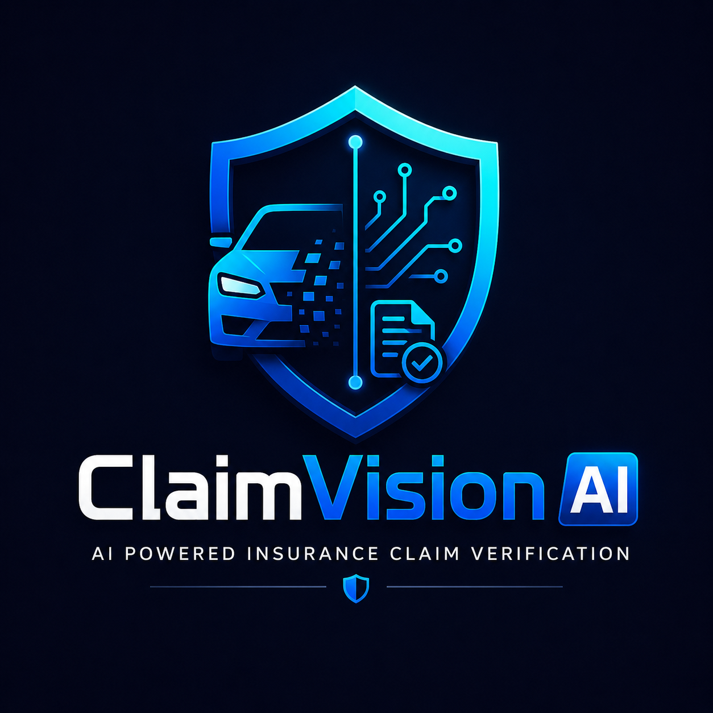
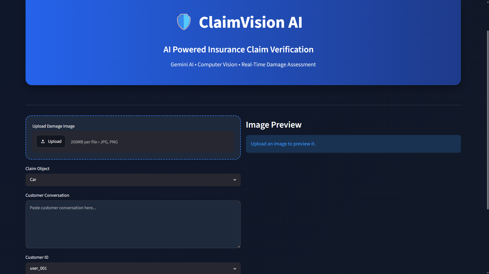
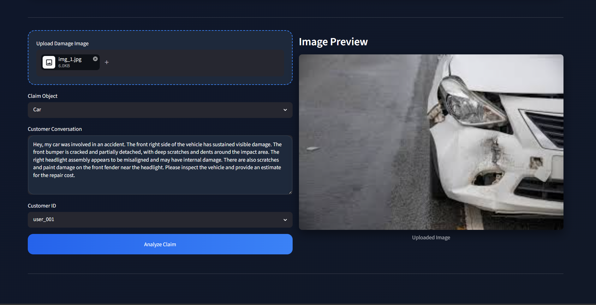
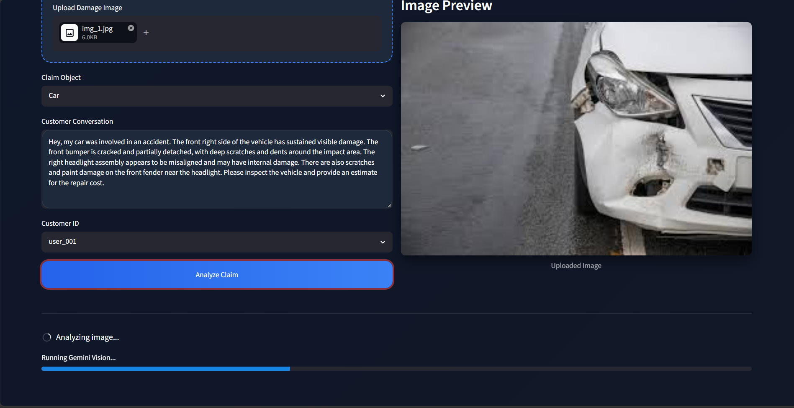
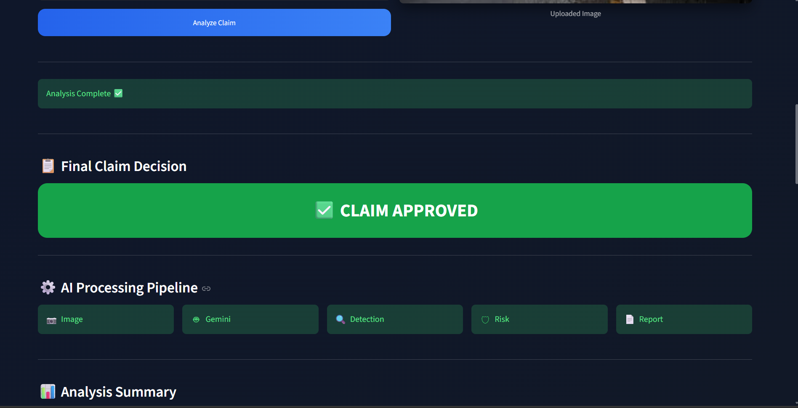
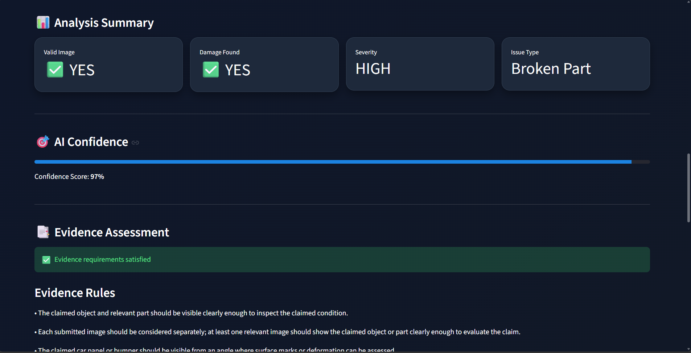
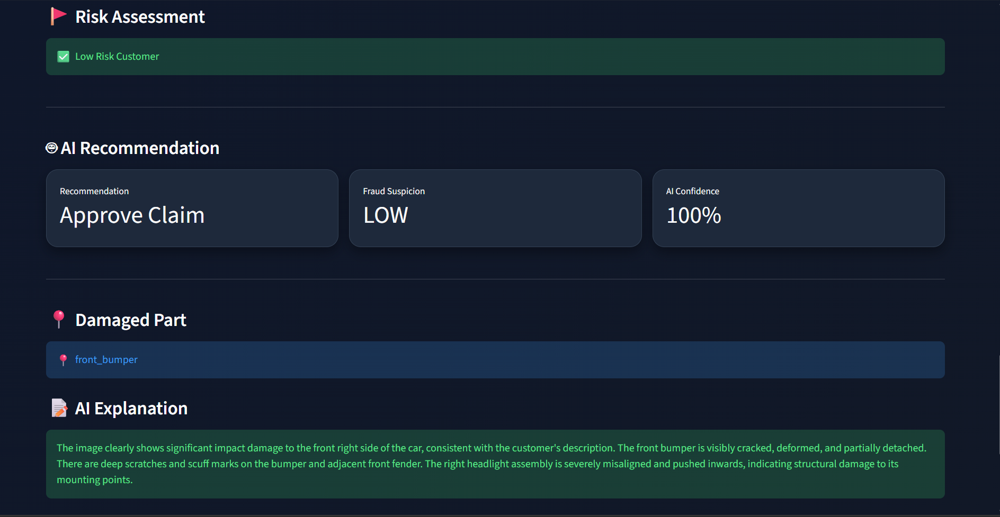
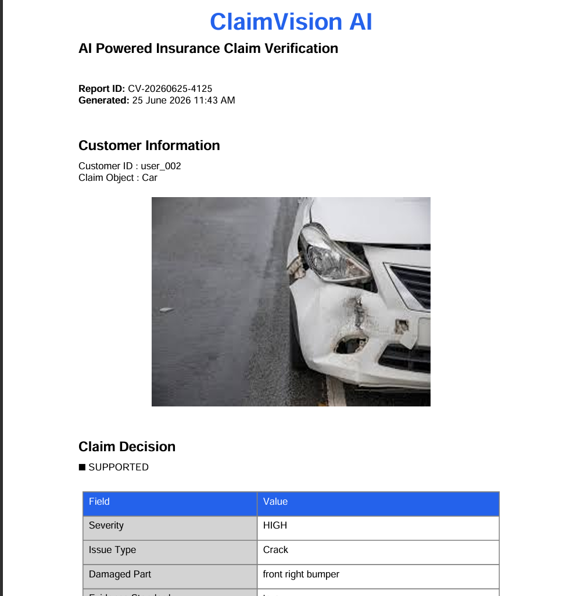

<div align="center">



# 🛡️ ClaimVision AI

### AI Powered Insurance Claim Verification System

**Detect Damage • Verify Evidence • Prevent Fraud • Generate Reports**

[]()
[]()
[]()
[]()

[](https://claimvision-ai.streamlit.app/)

[](https://youtu.be/bg8ddYtOxtI)

**AI-Powered Insurance Claim Verification Platform**

</div>

---

# 📌 Overview

ClaimVision AI is an AI-powered insurance claim verification platform that automates the initial claim assessment process using Google's Gemini Vision model.

Instead of relying solely on manual inspection, the system analyzes uploaded damage images, understands the customer's claim, checks historical claim records, validates evidence requirements, detects possible fraud indicators, and generates a professional PDF report.

The goal is to reduce fraudulent claims while speeding up genuine insurance approvals.

---

# 🎥 Project Demo

<p align="center">

<a href="https://youtu.be/bg8ddYtOxtI">

</a>

<br><br>

<a href="https://youtu.be/bg8ddYtOxtI">

</a>

</p>

---

# ✨ Features

✅ AI Damage Detection

✅ Customer Conversation Analysis

✅ Gemini Vision Image Understanding

✅ Insurance Claim Decision Engine

✅ Fraud Risk Assessment

✅ Evidence Verification

✅ Customer History Analysis

✅ Professional PDF Report Generation

✅ Beautiful Streamlit Dashboard

---

# 🖥 Application Screens

## Landing Page



---

## Upload Claim



---

## AI Processing



---

## Claim Decision



---

## Analysis Summary



---

## Risk Assessment



---

## PDF Report



---

# ⚙ Workflow

```
Customer
      │
      ▼
Upload Image
      │
      ▼
Gemini Vision Analysis
      │
      ▼
Conversation Analysis
      │
      ▼
Evidence Verification
      │
      ▼
History Check
      │
      ▼
Decision Engine
      │
      ▼
Claim Approval / Rejection
      │
      ▼
PDF Report
```

---

# 🧠 Technologies Used

| Technology | Purpose |
|------------|----------|
| Python | Backend |
| Streamlit | Web Application |
| Google Gemini 2.5 Flash | Image Understanding |
| Pillow | Image Processing |
| Pandas | Dataset Handling |
| CSV | Claim Records |
| ReportLab | PDF Generation |
| dotenv | API Management |

---

# 📂 Project Structure

```
ClaimVision-AI
│
├── code
│   ├── assets
│   │   ├── logo.png
│   │   ├── style.css
│   │   └── screenshots
│   ├── image_analyzer.py
│   ├── evidence_checker.py
│   ├── history_checker.py
│   ├── decision_engine.py
│   ├── streamlit_app.py
│   └── reports
│
├── dataset
│
├── docs
│
├── requirements.txt
│
├── README.md
│
└── LICENSE
```

---

# 🚀 Installation

Clone the repository

```bash
git clone https://github.com/Ashugiri123/ClaimVision-AI.git
```

Go inside project

```bash
cd ClaimVision-AI
```

Create virtual environment

```bash
python -m venv .venv
```

Activate

Windows

```bash
.venv\Scripts\activate
```

Install dependencies

```bash
pip install -r requirements.txt
```

Create a `.env`

```
GEMINI_API_KEY=YOUR_API_KEY
```

Run

```bash
streamlit run code/streamlit_app.py
```

---

# 📊 AI Decision Parameters

The system evaluates claims using:

- Visible Damage Detection
- Damage Severity
- Claimed Object Validation
- Customer Conversation
- Historical Claims
- Fraud Indicators
- Evidence Rules
- Missing Documents
- AI Confidence Score

---

# 📄 Generated Report

The application automatically generates a professional insurance assessment report containing

- Customer Details

- Uploaded Damage Image

- Claim Status

- Damage Severity

- Risk Analysis

- AI Explanation

- Recommendation

---

# 🔮 Future Improvements

- Multi Image Verification

- OCR for Vehicle Documents

- Insurance API Integration

- GPS Metadata Validation

- VIN Number Verification

- Object Detection Model

- Admin Dashboard

- Real-time Claim Tracking

---

# 👨‍💻 Developer

**Ashutosh Giri**

Computer Science Engineering Student

Google Student Ambassador

---

# 📜 License

This project is licensed under the MIT License.

---

<div align="center">

### ⭐ If you like this project, don't forget to Star the repository ⭐

</div>
